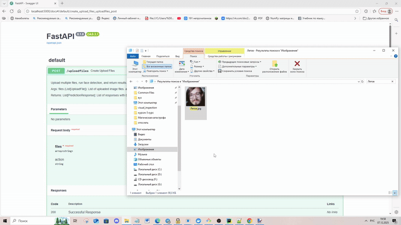

## Usage

- git clone https://github.com/Arthur-Kitsuragi/face-recognition

- cd face-recognition

- docker build -t face-recognition-app .

- docker run -d --gpus all -p 5000:5000 face-recognition-app

- open your browser and go to http://localhost:5000/docs

- pytest -v tests/ (another tests)

## Warning

You need to have access to fal-api to test prompt-editing.

## Example of usage (bounding box)

